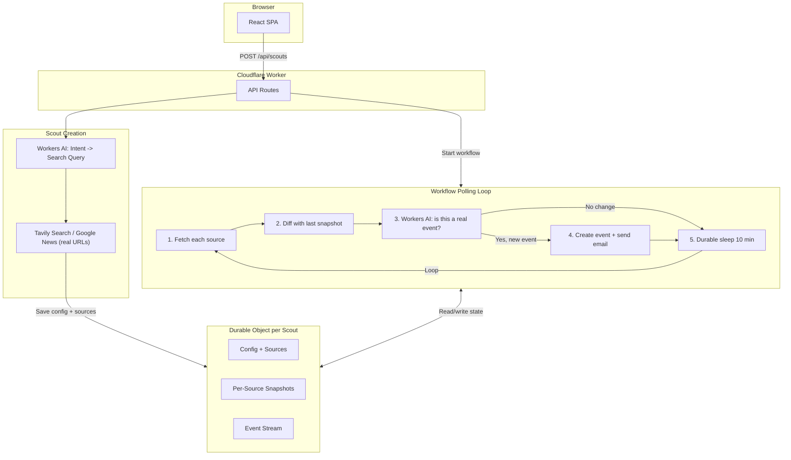

# Terascout Implementation Plan

## Core Concept

This is **event intelligence**, not a crawler. The user describes an intent in plain English. The LLM plans _what_ to watch and _how_. Workflows poll known sources and diff state. Durable Objects track an event stream. One email fires per distinct state transition. No schedules exposed to the user. No product bloat.

## Architecture



## Tech Stack (all free tier)

- **Frontend**: React 19, Vite 7, Tailwind CSS v4, shadcn/ui (already scaffolded)
- **Backend**: Cloudflare Workers (single worker serves everything)
- **State**: Durable Objects with SQLite (1 per scout -- config, snapshots, event stream)
- **Execution**: Cloudflare Workflows (durable sleep, retries, self-looping)
- **Web Fetching**: Plain `fetch()` + HTML text extraction (Browser Rendering as optional stretch)
- **LLM**: Workers AI `@cf/meta/llama-3.1-8b-instruct-fp8` (change analysis + query extraction). LLMs have no web access—they hallucinate URLs.
- **Source Discovery**: Google News search URLs only. The search page is dynamic—new articles appear when we poll. No fixed article URLs (Tavily article URLs rarely update).
- **Email**: Resend (API key as Cloudflare secret)

## Source Discovery (search URLs are dynamic)

**LLMs have no web access.** We use Google News search URLs—no fixed article URLs.

- **Google News search URL**: `https://news.google.com/search?q=${query}`. The page is dynamic—new articles appear when we poll. One source per scout, always fresh.
- **LLM**: Extracts search query from user intent (e.g. "lmk about spacex IPO" → "spacex IPO"). No URL hallucination.

### LLM Call 1: Query Extraction (at scout creation)

User says: _"Keep me updated on NVIDIA GPU drops"_

LLM extracts: `"NVIDIA GPU drops"` (no conversational filler). That becomes the search query for Tavily or Google News.

### LLM Call 2: Event Analysis (during polling, only when diff detected)

When a source's HTML changes, the LLM sees the old vs new text and decides:

```json
{
  "is_event": true,
  "summary": "RTX 5090 Founders Edition is now showing 'Add to Cart' (was 'Out of Stock')"
}
```

This prevents noisy false positives from minor page changes (ads, timestamps, etc.).

## Event Stream Model (the key insight)

### Wrong model (single flag)

```
Scout -> notified: true/false   // breaks on second drop
```

### Correct model (event stream)

```
Scout -> events[]               // one email per event, forever
```

Each detected state transition becomes a new event with its own `notified` flag:

```ts
interface ScoutEvent {
  eventId: string; // hash(sourceUrl + oldHash + newHash + detectedAt_rounded)
  sourceUrl: string;
  summary: string;
  detectedAt: string;
  notified: boolean;
}
```

- Multiple drops = multiple emails (one per drop)
- Same drop retried by Workflow = idempotent (same eventId, already notified)
- GPU goes out of stock and back = new event (different state transition)

## File Structure

```
terascout/
├── wrangler.jsonc              # DO, Workflow, AI bindings
├── worker/
│   ├── index.ts                # Worker entry: API routes
│   ├── scout-do.ts             # Durable Object: config, snapshots, events
│   ├── scout-workflow.ts       # Workflow: fetch -> diff -> analyze -> notify -> sleep -> loop
│   ├── lib/
│   │   ├── ai.ts               # Source discovery (Google News) + change analysis (LLM)
│   │   ├── fetcher.ts          # Fetch + extract text from HTML
│   │   └── email.ts            # Resend email sender
│   └── types.ts                # ScoutConfig, ScoutEvent, Source, Env
├── frontend/
│   ├── App.tsx                 # Main layout
│   ├── components/
│   │   ├── ui/                 # shadcn components
│   │   ├── HeroSearch.tsx      # Big search bar
│   │   ├── ScoutForm.tsx       # Dialog: just query + email, submit
│   │   └── ScoutList.tsx       # Active scouts + detected events
│   ├── lib/
│   │   ├── utils.ts            # cn() util
│   │   └── api.ts              # Frontend API client
│   └── index.css               # Tailwind styles
└── .env.example                # RESEND_API_KEY
```

## Implementation Details

### 1. Cloudflare Bindings ([wrangler.jsonc](wrangler.jsonc))

```jsonc
{
  "durable_objects": {
    "bindings": [{ "name": "SCOUT_DO", "class_name": "ScoutDO" }],
  },
  "migrations": [{ "tag": "v1", "new_sqlite_classes": ["ScoutDO"] }],
  "workflows": [
    {
      "name": "scout-workflow",
      "binding": "SCOUT_WORKFLOW",
      "class_name": "ScoutWorkflow",
    },
  ],
  "ai": { "binding": "AI" },
}
```

No Browser Rendering binding in v1 -- plain `fetch()` is simpler, free, and sufficient. Can add later as a stretch goal.

### 2. Durable Object ([worker/scout-do.ts](worker/scout-do.ts))

SQLite-backed DO. Internal fetch-based API:

- `POST /config` -- save scout config + sources (called once at creation)
- `GET /config` -- load config + sources (called by Workflow each loop)
- `GET /snapshot?source=URL` -- get last snapshot hash for a source
- `POST /snapshot` -- update snapshot hash for a source
- `POST /event` -- record a new event (checks eventId for idempotency)
- `GET /events` -- return all events for this scout (used by frontend)

State stored in SQLite tables within the DO:

- `config` table: single row with scoutId, query, email, createdAt
- `sources` table: url, label, strategy, lastHash, lastCheckedAt
- `events` table: eventId, sourceUrl, summary, detectedAt, notified

### 3. Workflow ([worker/scout-workflow.ts](worker/scout-workflow.ts))

Self-looping `WorkflowEntrypoint`. Fixed internal interval (~10 min for demo, configurable):

- **Step "load-config"**: Fetch config + sources from DO
- **Step "check-sources"**: For each source:
  - `fetch(url)` the page, extract visible text (skip source on failure—don't fail entire workflow)
  - Hash the extracted text
  - Compare with last snapshot hash from DO
  - If changed: send old text + new text + user query to Workers AI for event analysis
  - If LLM says it is a real event: create event in DO, send email via Resend
  - Update snapshot hash in DO
- **Step "sleep"**: `WorkflowStep.sleep("wait", "10 minutes")`
- Loop: Workflow calls itself again (or uses Workflow continuation pattern)

### 4. API Routes ([worker/index.ts](worker/index.ts))

Minimal:

- `POST /api/scouts` -- body: `{ query, email }`. Calls Workers AI for source discovery, creates DO, saves config + sources, starts Workflow. Returns `{ scoutId }`
- `GET /api/scouts/:id` -- proxies to DO to get config + events
- `DELETE /api/scouts/:id` -- cancels Workflow, cleans up
- Everything else falls through to `env.ASSETS.fetch(req)` for SPA

### 5. Helpers

- **[worker/lib/ai.ts](worker/lib/ai.ts)**:
  - `discoverSources(ai, query)` -- LLM extracts search query → Google News search URL. One dynamic source per scout.
  - `analyzeChange(ai, query, oldText, newText)` -- "Did a meaningful event occur?" Uses `@cf/meta/llama-3.1-8b-instruct-fp8`
- **[worker/lib/fetcher.ts](worker/lib/fetcher.ts)**: `fetchPageText(url)` -- fetches URL, strips HTML tags, returns clean text (simple regex/string approach, no heavy parsing lib)
- **[worker/lib/email.ts](worker/lib/email.ts)**: `sendEventEmail(apiKey, to, scoutQuery, event)` -- uses Resend SDK. Clean subject line like "Terascout: RTX 5090 now in stock". Minimal HTML body with summary + source link

### 6. Frontend (toned down, clean)

Install via `pnpx shadcn@latest add`: `dialog`, `input`, `label`, `badge`, `sonner`

**No schedule controls. No frequency pickers. No end dates. Just query + email.**

- **HeroSearch.tsx**: Centered search input with "What do you want to track?" placeholder. On Enter/submit, opens ScoutForm dialog
- **ScoutForm.tsx**: shadcn Dialog with:
  - The query displayed (read-only, from search bar)
  - Email input
  - Submit button -> `POST /api/scouts`
  - Success toast via sonner
- **ScoutList.tsx**: Below the search bar. Shows active scouts as cards with:
  - Query text
  - Status badge ("Watching" / "Event detected")
  - List of detected events with timestamps
  - Delete button
- **App.tsx**: Dark mode, centered layout, Terascout branding at top, HeroSearch, ScoutList

### 7. Styling

- Dark mode default (Cloudflare aesthetic)
- Centered single-column layout
- Subtle glow/gradient on search input
- shadcn neutral base (already configured)
- Minimal -- the restraint IS the design

## Free Tier Budget

For a demo with ~3 scouts polling every 10 minutes:

- **Workers AI**: 10K neurons/day. Source discovery ~500 neurons (once). Each poll with diff ~500 neurons. 3 scouts x 144 polls = worst case ~72K neurons, but LLM is only called when diff is detected (most polls = no change = 0 neurons). Realistically ~2-5K neurons/day
- **Workers**: 100K requests/day free. Each poll = ~3 fetches + 1 DO call. Negligible
- **Durable Objects**: 1M requests/month free. Negligible
- **Resend**: 100 emails/day free tier. More than enough

## Key Design Decisions

- **Event stream, not notification flag** -- multiple drops = multiple emails, with idempotency via event hashing
- **LLM for planning, not fetching** -- source discovery at creation, event analysis only on diff. This is agent architecture, not a wrapper
- **Plain fetch over Browser Rendering** -- simpler, no extra binding, works for most public pages. Browser Rendering is a stretch goal
- **No user-facing schedule controls** -- polling interval is an internal implementation detail (10 min). Shows engineering restraint
- **SQLite-backed DOs** -- structured storage for sources, snapshots, events within each scout
- **Resend for email** -- already in deps, simple SDK, generous free tier
